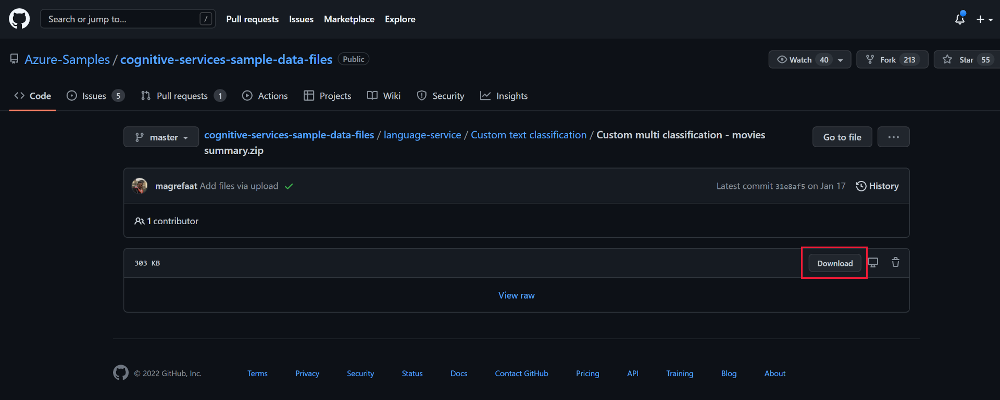
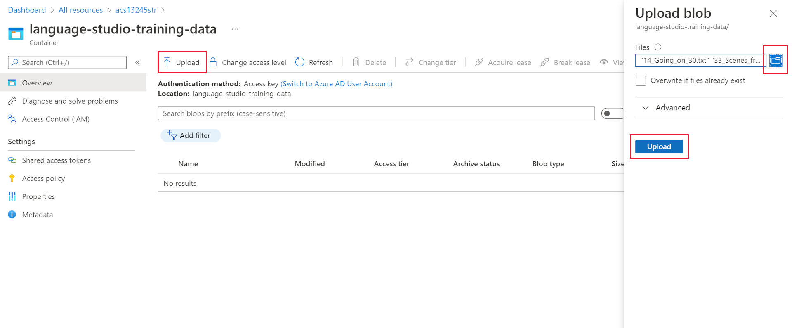
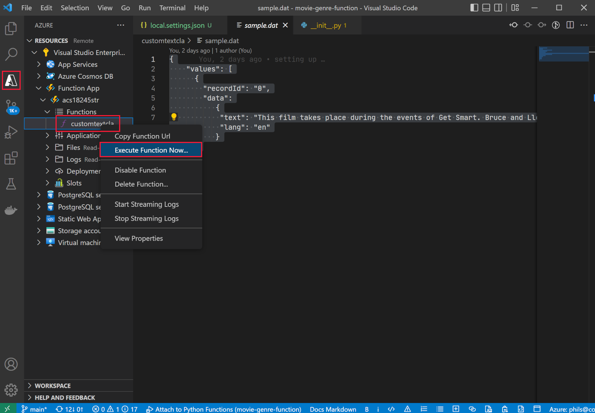

---
lab:
  title: Enriquecimiento de un índice de búsqueda de IA con clases personalizadas
---

# Enriquecimiento de un índice de búsqueda de IA con clases personalizadas

Ha creado una solución de búsqueda y ahora quiere agregar Servicios de Azure AI para enriquecimiento del lenguaje a los índices.

En este ejercicio creará una solución de Búsqueda de Azure AI y enriquecerá un índice con los resultados de un proyecto de clasificación de texto personalizado de Language Studio. Creará una aplicación de función para conectar la búsqueda y el modelo de clasificación.

> **Nota**: Para completar este ejercicio, necesitará una suscripción a Microsoft Azure. Si aún no tiene una, puede suscribirse para solicitar una prueba gratuita en [https://azure.com/free](https://azure.com/free?azure-portal=true).

## Configuración del entorno de desarrollo con Python, VS Code y extensiones de VS Code

Instale estas herramientas para completar este ejercicio. También puede seguir los pasos siguientes sin estas herramientas.

1. Instalación de [VS Code](https://code.visualstudio.com/)
1. Instalación de [Azure Core Functions Tool](https://github.com/Azure/azure-functions-core-tools)
1. Instalación de [Extensiones de herramientas de Azure para VS Code](https://code.visualstudio.com/docs/azure/extensions)
1. Instalación de [Python 3.8](https://www.python.org/downloads/release/python-380/) para su sistema operativo
1. Instalación de [Extensión de Python para VS Code](https://marketplace.visualstudio.com/items?itemName=ms-python.python)

## Configuración de recursos de Azure

Para ahorrar tiempo, seleccione esta plantilla de Azure ARM para crear recursos que necesitará más adelante en el ejercicio.

### Implementación de una plantilla de ARM pregenerada

1. [](https://portal.azure.com/#create/Microsoft.Template/uri/https%3A%2F%2Fraw.githubusercontent.com%2FMicrosoftLearning%2Fmslearn-doc-intelligence%2Fmain%2Fcognitive-search%2Fazuredeploy.json) seleccione este vínculo para crear sus recursos de inicio. Es posible que tenga que copiar y pegar el [vínculo directo](https://portal.azure.com/#create/Microsoft.Template/uri/https%3A%2F%2Fraw.githubusercontent.com%2FMicrosoftLearning%2Fmslearn-doc-intelligence%2Fmain%2Fcognitive-search%2Fazuredeploy.json) en la barra de búsqueda.

    
1. En **Grupo de recursos**, seleccione **Crear nuevo** y asígnele el nombre **cog-search-language-exe**.
1. En **Región**, seleccione una [región admitida](/azure/ai-services/language-service/custom-text-classification/service-limits#regional-availability) cercana a su ubicación.
1. El **Prefijo de recurso** debe ser único a nivel global; escriba un prefijo aleatorio con números y caracteres en minúsculas como, por ejemplo, **acs18245**.
1. En **Ubicación**, seleccione la misma región que ha elegido anteriormente.
1. Seleccione **Revisar + crear**.
1. Seleccione **Crear**.

    > **Nota**: Se muestra el error **Tiene que aceptar los términos de servicio siguientes para crear este recurso correctamente**. Seleccione **Crear** para indicar que los acepta.

1. Seleccione **Ir al grupo de recursos** para ver todos los recursos que ha creado.

    
Configurará un índice de Azure Cognitive Search y creará una función de Azure y un proyecto de Language Studio para identificar los géneros de películas a partir de sus resúmenes.

### Cargado de datos de ejemplo para entrenar servicios de lenguaje

En este ejercicio se usan 210 archivos de texto que contienen un resumen del argumento para una película. El nombre de los archivos de texto es el título de la película. La carpeta también contiene un archivo **movieLabels.json** que asigna los géneros de una película al archivo. Para cada archivo hay una entrada JSON como esta:

```json
{
    "location": "And_Justice_for_All.txt",
    "language": "en-us",
    "classifiers": [
        {
            "classifierName": "Mystery"
        },
        {
            "classifierName": "Drama"
        },
        {
            "classifierName": "Thriller"
        },
        {
            "classifierName": "Comedy"
        }
    ]
},
```

1. Descargue los [datos de ejemplo](https://github.com/Azure-Samples/cognitive-services-sample-data-files/blob/master/language-service/Custom%20text%20classification/Custom%20multi%20classification%20-%20movies%20summary.zip) de GitHub y guárdelos localmente en el equipo.

    
1. Abra el archivo **Custom multi classification - movies summary.zip** y extraiga la carpeta que contiene todos los archivos.

    > **Nota**: Estos archivos se usan para entrenar un modelo en Language Studio, y también se indexarán todos los archivos de Azure Cognitive Search.

1. En [Azure Portal](https://portal.azure.com/), seleccione **Grupos de recursos** y el grupo de recursos.
1. Seleccione la cuenta de almacenamiento que creó, por ejemplo, **acs18245str**.

    
1. Seleccione **Contenedores** en el lado izquierdo y, después, **+ Contenedor**.
1. En el panel **Nuevo contenedor**, en **Nombre** escriba **language-studio-training-data**.
1. En **Nivel de acceso anónimo**, seleccione **Contenedor (acceso de lectura anónimo para contenedores y blobs)**.
1. Seleccione **Crear**.
1. Seleccione el nuevo contenedor que acaba de crear, **language-studio-training-data**.
    
1. Seleccione **Cargar** en la parte superior del panel.
1. En el panel **Cargar blob**, seleccione **Examinar archivos**.
1. Vaya a la ubicación donde ha descargado los archivos de ejemplo, seleccione todos los archivos de texto (`.txt`) y JSON (`.json`).
1. Seleccione **Cargar** en el panel.
1. Cierre el panel **Cargar blob**.

### Creación de un recurso de idioma

1. En el vínculo de ruta de navegación de la parte superior de la página, seleccione **Inicio**.
1. Seleccione **Crear** en **Servicio de lenguaje**.
1. Seleccione **Crear**.
1. Seleccione la opción que incluye **Clasificación de texto personalizado y Reconocimiento de entidades con nombre personalizadas**.

    
1. Seleccione **Continuar para crear el recurso**.

    
1. En **Grupo de recursos**, elija **cog-search-language-exe**.
1. En **Región**, seleccione la región que ha usado anteriormente.
1. En **Nombre**, escriba **learn-language-service-for-custom-text**. Esto debe ser único a nivel global, por lo que es posible que tenga que agregar un número aleatorio o caracteres al final.
1. En plan de **Tarifa**, seleccione **S**.
1. En **Cuenta de almacenamiento nueva o existente**, seleccione **Cuenta de almacenamiento existente**.
1. En **Cuenta de almacenamiento de la suscripción y la región del recurso seleccionados actualmente**, seleccione la cuenta de almacenamiento que ha creado, por ejemplo, **acs18245str**.
1. Acepte los términos de **Aviso de IA responsable** y, a continuación, seleccione **Revisar y crear**.
1. Seleccione **Crear**.
1. Espere a que se implementen los recursos y, a continuación, seleccione **Ir al grupo de recursos**.
1. Seleccione **learn-language-service-for-custom-text**.

    
1. Desplácese hacia abajo en el panel **Información general** y seleccione **Comenzar con Language Studio**.
1. Si se le pide que elija un recurso de Lenguaje, seleccione el recurso que creó anteriormente.

### Creación de un proyecto de clasificación personalizada de texto en Language Studio

1. En la página principal de Language Studio, seleccione **Crear nuevo** y, a continuación, seleccione **Clasificación personalizada de texto**.

    

1. Seleccione **Next** (Siguiente).

    
1. Seleccione **Clasificación de varias etiquetas** y, a continuación, **Siguiente**.

    

1. En **Nombre**, escriba **movie-genre-classifier**.
1. En **Idioma principal del texto** selecciones **Inglés (EE.UU.)**.
1. En **Descripción**, escriba **Un modelo que pueda identificar el género de una película a partir de su resumen**.
1. Seleccione **Sí, habilitar el conjunto de datos multilingüe**.
1. Seleccione **Next** (Siguiente).

    

1. En **Contenedor de Blob Storage**, elija **language-studio-training-data**.
1. Seleccione **Sí, mis documentos ya están etiquetados y tengo un archivo de etiquetas JSON con el formato correcto**.
1. En **Etiquetar documentos**, elija **movieLabels**.
1. Seleccione **Next** (Siguiente).
1. Seleccione **Create project** (Crear proyecto).

### Entrenamiento de un modelo de IA de clasificación personalizada de texto

1. En el lado izquierdo, seleccione **Trabajos de entrenamiento**.

    

1. Seleccione **Iniciar un trabajo de entrenamiento**.

    
1. En **Entrenar un nuevo modal**, escriba **movie-genre-classifier**.
1. Seleccione **Entrenar**.
1. El entrenamiento del modelo clasificador debería tardar menos de 10 minutos. Espere a que el estado cambie a **Entrenamiento correcto**.

### Implementación de un modelo de IA de clasificación personalizada de texto

1. En el lado izquierdo, seleccione **Implementar un modelo**.

    
1. Seleccione **Agregar una implementación**.

    
1. En **Crear un nuevo nombre de implementación**, escriba **test-release**.
1. En **Modelo**, seleccione **movie-genre-classifier**.
1. Seleccione **Implementar**.

Deje abierta esta página web para más adelante en este ejercicio.

### Creación de un índice de Búsqueda de Azure AI

Cree un índice de búsqueda que pueda enriquecer con este modelo; indexará todos los archivos de texto que contienen los resúmenes de películas que ya ha descargado.

1. En [Azure Portal](https://portal.azure.com/), seleccione **Grupo de recursos** y, después, seleccione la cuenta de almacenamiento que ha creado, por ejemplo, **acs18245str**.
1. Seleccione **Contenedores** en el lado izquierdo y, después, **+ Contenedor**.
1. En el panel **Nuevo contenedor**, en **Nombre**, escriba **search-data**.
1. En **Nivel de acceso anónimo**, elija **Contenedor**.
1. Seleccione **Crear**.
1. Seleccione el nuevo contenedor que acaba de crear, **search-data**.
1. Seleccione **Cargar** en la parte superior del panel.
1. En el panel **Cargar blob**, seleccione **Examinar archivos**.
1. Vaya a la ubicación donde ha descargado los archivos de ejemplo, seleccione **SÓLO** los archivos de texto (`.txt`).
1. Seleccione **Cargar** en el panel.
1. Cierre el panel **Cargar blob**.

### Importación de documentos en Búsqueda de Azure AI

1. En la izquierda, seleccione **Grupos de recursos**, el grupo de recursos y, después, su servicio de búsqueda.

1. Seleccione **Importar datos**.

    
1. En **Origen de datos** seleccione **Azure Blob Storage**.
1. En **Nombre del origen de datos**, escriba **movie-summaries**.
1. Seleccione **Elegir una conexión existente**, la cuenta de almacenamiento y, después, el contenedor que acaba de crear, **search-data**.
1. Seleccione **Agregar aptitudes cognitivas (opcional)**.
1. Expanda la sección **Adjuntar servicios de IA** y, después, seleccione el servicio Azure AI que hay debajo de la opción gratis.

    
1. Expanda la sección **Agregar enriquecimientos**.

    
1. Deje todos los campos con sus valores predeterminados y seleccione **Extraer nombres de personas**.
1. Seleccione **Extraer frases clave**.
1. Seleccione **Detectar idioma**.
1. Seleccione **Siguiente: Personalizar el índice de destino**.

    
1. Deje todos los campos con sus valores predeterminados, excepto para **metadata_storage_name**: seleccione **Recuperable** y **Permite búsquedas**.
1. Seleccione **Siguiente: Crear indizador**.
1. Seleccione **Submit** (Enviar).

El indexador se ejecutará y creará un índice de los 210 archivos de texto. No es necesario esperar a que el indexador continúe con los pasos siguientes.

## Creación de una aplicación de función para enriquecer el índice de búsqueda

Ahora creará una aplicación de funciones de Python a la que el conjunto de aptitudes personalizado de Cognitive Search llamará. La aplicación de funciones usará el modelo de clasificador personalizado de texto para enriquecer el índice de búsqueda.

1. En el terminal, clone este repositorio de GitHub en la máquina.

    ```bash
    git clone https://github.com/MicrosoftLearning/mslearn-doc-intelligence movie-genre-function
    ```

1. En Visual Studio Code, abra la carpeta **movie-genre-function** que acaba de clonar.

    
1. Si ha instalado todas las extensiones necesarias, se le pedirá que optimice el proyecto. Seleccione **Sí**.
    
1. Seleccione el intérprete de Python; debe ser la versión 3.8.
1. El área de trabajo se actualizará; si se le pide que lo conecte a la carpeta del área de trabajo, seleccione **Sí**.
1. Presione **F5** para depurar el proyecto.

    
    Si la aplicación se está ejecutando, debería ver una dirección URL de localhost que se puede usar para las pruebas locales.

1. Detenga la depuración de la aplicación: presione **MAYÚS** + **F5**.

### Implementación de la aplicación local de funciones en Azure

1. En Visual Studio Code, presione **F1** para abrir la paleta de comandos.
1. En la paleta de comandos, busque y seleccione `Azure Functions: Create Function App in Azure...`.
1. Escriba un nombre único a nivel global para la aplicación de funciones, por ejemplo, **acs13245str-function-app**.
1. En **Seleccionar una pila en tiempo de ejecución**, seleccione **Python 3.8**.
1. Seleccione la misma ubicación que ha usado antes.

1. En el panel de navegación izquierdo, seleccione la extensión **Azure**.
    
1. Expanda **Recursos**, expanda **Aplicación de funciones** y, después, haga clic con el botón secundario en la función, por ejemplo, **acs13245-function-app**.
1. Seleccione **Implementar en Function App**. Espere a que se implemente la aplicación.
1. Expanda la aplicación, haga clic con el botón derecho en **Configuración de aplicación** y seleccione **Descargar configuración remota**.
1. En el lado izquierdo, seleccione **Explorador** y, a continuación, **local.settings.json**.

    
La aplicación de funciones debe estar conectada al modelo de clasificación personalizada de texto. Siga estos pasos para obtener los valores de configuración.

1. En el explorador, vaya a **Language Studio**; debería estar en la página **Implementar un modelo**.

    
1. Selección del modelo Selecciona **Obtener URL de predicción**.
1. Seleccione el icono de copia situado junto a la **dirección URL de predicción**.
1. En Visual Studio Code, en la parte inferior de **local.settings.json**, pegue la dirección URL de predicción.
1. En **Language Studio**, a la izquierda, seleccione **Configuración de proyecto**.

    
1. Haga clic en el icono de copiar situado junto a la **clave principal**.
1. En Visual Studio Code, en la parte inferior de **local.settings.json**, pegue la clave principal.
1. Edite la configuración para agregar estas cuatro líneas en la parte inferior, copie el punto de conexión en el valor `TA_ENDPOINT`.

    ```json
    ,
    "TA_ENDPOINT": " [your endpoint] ",
    "TA_KEY": " [your key] ",
    "DEPLOYMENT": "test-release",
    "PROJECT_NAME": "movie-genre-classifier"
    ```

1. Copie la clave principal en el valor `TA_KEY`.

    ```json
    {
      "IsEncrypted": false,
      "Values": {
        "AzureWebJobsStorage": "DefaultEndpointsProtocol=https;AccountName=...",
        "FUNCTIONS_EXTENSION_VERSION": "~4",
        "FUNCTIONS_WORKER_RUNTIME": "python",
        "WEBSITE_CONTENTAZUREFILECONNECTIONSTRING": "DefaultEndpointsProtocol=https;AccountName=...",
        "WEBSITE_CONTENTSHARE": "acs...",
        "APPINSIGHTS_INSTRUMENTATIONKEY": "6846...",
        "TA_ENDPOINT": "https://learn-languages-service-for-custom-text.cognitiveservices.azure.com/language/analyze-text/jobs?api-version=2022-05-01",
        "TA_KEY": "7105e938ce1...",
        "DEPLOYMENT": "test-release",
        "PROJECT_NAME": "movie-genre-classifier"
      }
    }

    ```

    La configuración debe ser similar a la anterior, con los valores del proyecto.
 
1. Presione **CTRL**+**S** para guardar los cambios de **local.settings.json**.
1. En el panel de navegación izquierdo, seleccione la extensión **Azure**.
1. Expanda **Recursos** y, en su suscripción, expanda **Aplicación de funciones**, haga clic con el botón secundario en **Configuración de la aplicación** y seleccione **Cargar configuración local**.

### Prueba de la aplicación de funciones remota

Hay una consulta de ejemplo que puede usar para probar que la aplicación de funciones y el modelo clasificador funcionan correctamente.

1. En el lado izquierdo, seleccione **Explorador**, expanda la carpeta **customtectcla** y, a continuación, seleccione **sample.dat**.

    
1. Copie el contenido del archivo.
1. En el lado izquierdo, seleccione la extensión **Azure**.

    
1. En **Function App**, expanda **Funciones**, haga clic con el botón derecho en **customtextcla** y, a continuación, seleccione **Ejecutar función ahora**.
1. En **Escribir cuerpo de la solicitud**, pegue los datos de ejemplo que ha copiado y presione **Enter**.

    La aplicación de funciones responderá con los resultados JSON.

1. Expanda la notificación para ver todos los resultados.

    
    La respuesta JSON debería tener el siguiente aspecto:

    ```json
    {"values": 
        [
            {"recordId": "0", 
            "data": {"text": 
            [
                {"category": "Action", "confidenceScore": 0.99}, 
                {"category": "Comedy", "confidenceScore": 0.96}
            ]}}
        ]
    }
    ```

### Incorporación de un campo al índice de búsqueda

Necesita un lugar para almacenar el enriquecimiento devuelto por la nueva aplicación de funciones. Siga estos pasos para agregar un nuevo campo compuesto para almacenar la clasificación de texto y la puntuación de confianza.

1. En [Azure Portal](https://portal.azure.com/), vaya al grupo de recursos que contiene el servicio de búsqueda y, después, seleccione el servicio Cognitive Search que ha creado, por ejemplo, **acs18245-search-service**.
1. En el panel **Información general**, seleccione **Índices**.
1. Seleccione **azurebob-index**.
1. Seleccione **Editar JSON**.
1. Agregue los nuevos campos al índice y pegue el JSON que hay debajo del campo de contenido.

    ```json
    {
      "name": "textclass",
      "type": "Collection(Edm.ComplexType)",
      "analyzer": null,
      "synonymMaps": [],
      "fields": [
        {
          "name": "category",
          "type": "Edm.String",
          "facetable": true,
          "filterable": true,
          "key": false,
          "retrievable": true,
          "searchable": true,
          "sortable": false,
          "analyzer": "standard.lucene",
          "indexAnalyzer": null,
          "searchAnalyzer": null,
          "synonymMaps": [],
          "fields": []
        },
        {
          "name": "confidenceScore",
          "type": "Edm.Double",
          "facetable": true,
          "filterable": true,
          "retrievable": true,
          "sortable": false,
          "analyzer": null,
          "indexAnalyzer": null,
          "searchAnalyzer": null,
          "synonymMaps": [],
          "fields": []
        }
      ]
    },
    ```

    Ahora el índice debería tener un aspecto similar al siguiente.

    
1. Seleccione **Guardar**.

### Edición del conjunto de aptitudes personalizado para llamar a la aplicación de funciones

El índice de Cognitive Search necesita una manera de rellenar estos nuevos campos. Edite el conjunto de aptitudes que ha creado anteriormente para llamar a la aplicación de funciones.

1. En la parte superior de la página, seleccione el vínculo de servicio de búsqueda, por ejemplo, **acs18245-search-service | Índices**.

1. En el panel **Información general**, seleccione **Índices**.

    
1. Seleccione **azureblob-skillset**.
1. Agregue la definición del conjunto de aptitudes personalizado siguiente pegándola como el primer conjunto de aptitudes.

    ```json
    {
      "@odata.type": "#Microsoft.Skills.Custom.WebApiSkill",
      "name": "Genre Classification",
      "description": "Identify the genre of your movie from its summary",
      "context": "/document",
      "uri": "URI",
      "httpMethod": "POST",
      "timeout": "PT30S",
      "batchSize": 1,
      "degreeOfParallelism": 1,
      "inputs": [
        {
          "name": "lang",
          "source": "/document/language"
        },
        {
          "name": "text",
          "source": "/document/content"
        }
      ],
      "outputs": [
        {
          "name": "text",
          "targetName": "class"
        }
      ],
      "httpHeaders": {}
    },
    ```

Debe cambiar `"uri": "URI"` para que apunte a la aplicación de funciones.

1. En Visual Studio Code, seleccione la extensión **Azure**.

    
1. En **Funciones**, haga clic con el botón derecho en **customtextcla** y, a continuación, seleccione **Copiar dirección URL de la función**.
1. En el Portal de Azure reemplace el URI por la dirección URL de la función copiada. 
1. Seleccione **Guardar**.

### Edición de las asignaciones de campos en el indexador

Ahora tiene campos para almacenar el enriquecimiento y un conjunto de aptitudes para llamar a la aplicación de funciones. El último paso es indicar a Cognitive Search dónde colocar el enriquecimiento.

1. En la parte superior de la página, seleccione el vínculo de servicio de búsqueda, por ejemplo, **acs18245-search-service | Conjuntos de aptitudes**.

    
1. En el panel **Información general**, seleccione **Indexadores**.
1. Seleccione **azureblob-indexer**.
1. Seleccione **Definición de indexador (JSON)**.
1. Agregue una nueva asignación de campos de salida pegando esta definición de campo en la parte superior de la sección de campo de salida.

    ```json
    {
      "sourceFieldName": "/document/class",
      "targetFieldName": "textclass"
    },
    ```

    La definición JSON del indexador debería tener ahora este aspecto:

    
1. Seleccione **Guardar**.
1. Seleccione **Restablecer** y, a continuación, seleccione **Sí**.
1. Seleccione **Ejecutar** y, a continuación, seleccione **Sí**.

    El servicio Azure Cognitive Search ejecuta el indexador actualizado. El indexador usa el conjunto de aptitudes personalizado editado. El conjunto de aptitudes llama a la aplicación de funciones con el documento que se está indexando. El modelo de clasificador personalizado de texto usa el texto del documento para intentar identificar el género de la película. El modelo devuelve un documento JSON con géneros y niveles de confianza. El indexador asigna los resultados JSON a los campos del índice mediante la nueva asignación de campos de salida.

1. Seleccione **Historial de ejecución**.
1. Compruebe que el indexador se ha ejecutado correctamente en los 210 documentos.

    
    Es posible que tenga que seleccionar **Actualizar** para actualizar el estado del indexador.

## Prueba del índice de búsqueda enriquecido

1. En la parte superior de la página, seleccione el servicio de búsqueda, por ejemplo, **acs18245-search-service | Indizadores**.

1. En el panel **Información general**, seleccione **Índices**.
1. Seleccione **azurebob-index**.

    
1. Seleccione **Search**.
1. Explore los resultados de la búsqueda.

Cada documento del índice debe tener un nuevo campo `textclass` que se pueda buscar. Contiene un campo de categoría con los géneros de películas. Puede haber más de una. También muestra la confianza del modelo de clasificación personalizada de texto sobre el género identificado.

Ahora que ha completado el ejercicio, elimine todos los recursos que ya no necesita.

### Eliminación de recursos del ejercicio

1. En Azure Portal, vaya a la página Inicio y seleccione **Grupos de recursos**.
1. Seleccione los grupos de recursos que no necesite y luego **Eliminar grupo de recursos**.
