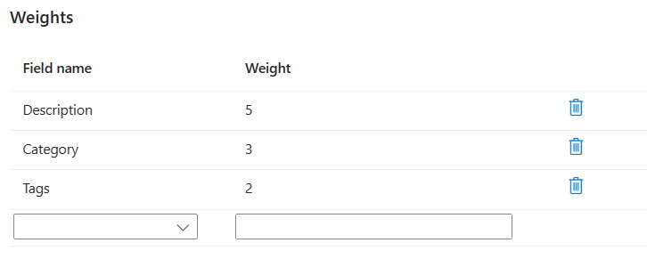

---
lab:
  title: Implementación de mejoras en los resultados de búsqueda
---

# Implementación de mejoras en los resultados de búsqueda

Tiene un servicio de búsqueda existente que usa una aplicación de reserva de vacaciones. Ha visto que la relevancia de los resultados de búsqueda afecta al número de reservas que recibe. También ha agregado recientemente hoteles en Portugal, por lo que le gustaría ofrecer portugués como idioma admitido.

En este ejercicio, agregará un perfil de puntuación para mejorar la relevancia de los resultados de búsqueda. Después, usará Servicios de Azure AI para agregar descripciones en portugués para todos los hoteles.

> **Nota**: Para completar este ejercicio, necesitará una suscripción a Microsoft Azure. Si aún no tiene una, puede solicitar una prueba gratuita en [https://azure.com/free](https://azure.com/free?azure-portal=true).

## Creación de recursos de Azure

Creará el servicio de búsqueda de Azure AI e importará datos de hoteles de ejemplo.

1. Inicie sesión en [Azure Portal](https://portal.azure.com/learn.docs.microsoft.com?azure-portal=true).
1. Seleccione **+ Crear un recurso**.
1. Busque **búsqueda** y seleccione **Búsqueda de Azure AI**.
1. Seleccione **Crear**.
1. Seleccione **Crear nuevo** en Grupo de recursos, nómbrelo **learn-advanced-search**.
1. En **Nombre del servicio**, escriba **advanced-search-service-12345**. El nombre debe ser único globalmente, por lo que debe agregar números aleatorios al final este.
1. Seleccione una región admitida cerca de usted.
1. Use los valores predeterminados para el **Plan de tarifa**.
1. Seleccione **Revisar + crear**.
1. Seleccione **Crear**.
1. Espere a que se implementen los recursos y, después, seleccione **Ir al recurso**.

### Importación de datos de ejemplo en el servicio de búsqueda

Importar los datos de ejemplo.

1. En el panel **Información general**, seleccione **Importar datos**.

    
1. En el panel **Importar datos**, en la lista desplegable **Origen de datos**, seleccione **Ejemplos**.
1. Seleccione **hotels-sample**.

1. En la pestaña **Agregar conocimientos cognitivos (opcional)**, expanda **Adjuntar servicios de IA** y, después, seleccione **Crear nuevo recurso de servicios de IA**.

    

### Creación de un servicio de Azure AI para admitir traducciones

1. En la pestaña nueva, inicie sesión en Azure Portal.
1. En **Grupo de recursos**, seleccione **learn-advanced-search**.
1. En **Región**, seleccione la misma región que eligió para el servicio de búsqueda.
1. En **Nombre**, escriba **learn-cognitive-translator-12345** o cualquier nombre. El nombre debe ser único globalmente, por lo que debe agregar números aleatorios al final este.
1. En **Plan de tarifa**, seleccione **Estándar S0**.
1. Marque **By checking this box I acknowledge that I have read and understood all the terms below** (Al marcar esta casilla, confirmo que he leído y comprendido todos los términos que aparecen a continuación).
1. Seleccione **Revisar + crear**.
1. Seleccione **Crear**.
1. Cuando se hayan creado los recursos, cierre la pestaña.

### Adición de un enriquecimiento de traducción

1. En la pestaña **Agregar conocimientos cognitivos (opcional)**, seleccione Actualizar.
1. Seleccione el nuevo servicio, **learn-cognitive-translator-12345**.
1. Expanda la sección **Agregar enriquecimientos**.
    
1. Seleccione **Traducir texto**, cambie el **Idioma de destino** a **portugués** y, después, cambie el **Nombre de campo** a **Description_pt**.
1. Seleccione **Siguiente: Personalizar el índice de destino**.

### Cambio del campo para que almacene texto traducido

1. En la pestaña **Personalizar índice de destino**, desplácese hasta la parte inferior de la lista de campos y cambie el **Analizador** a **Portugués (Portugal) - Microsoft** para el campo **Description_pt**.
1. Seleccione **Siguiente: Crear indizador**.
1. Seleccione **Submit** (Enviar).

    Se crea el índice, se ejecutará el indizador y se importarán 50 documentos que contienen datos de hoteles de ejemplo.
1. En el panel **Información general**, seleccione **Índices** y, después, **hotels-sample-index**.
1. Seleccione **Buscar** para ver JSON para todos los documentos del índice.
1. Busque **Description_pt** (puede usar **CTRL + F**) en los resultados y tenga en cuenta que no es una traducción al portugués de la descripción en inglés, sino que tiene este aspecto:

    ```json
    "Description_pt": "45",
    ```

Azure Portal asume que hay que traducir el primer campo del documento. Por lo tanto, usa la aptitud de traducción para traducir `HotelId`.

### Actualización del conjunto de aptitudes para traducir el campo correcto en el documento

1. En la parte superior de la página, seleccione el servicio de búsqueda, vínculo **advanced-search-service-12345 |Índices**.
1. Seleccione **Conjuntos de aptitudes** en Administración de búsqueda en el panel izquierdo y, a continuación, seleccione **hotels-sample-skillset**.
1. Edita el documento JSON y cambia la línea 9 a lo siguiente:

    ```json
    "context": "/document/Description",
    ```

1. Cambia el valor predeterminado de idioma a inglés en la línea 11:

    ```json
    "defaultFromLanguageCode": "en",
    ```

1. Cambia el campo de origen de la línea 15 al código siguiente:

    ```json
    "source": "/document/Description",
    ```

1. Seleccione **Guardar**.
1. En la parte superior de la página, seleccione el servicio de búsqueda, vínculo **advanced-search-service-12345 | Conjunto de aptitudes**.
1. En el panel **Información general**, seleccione **Índices** y, después, **hotels-sample-indexer**.
1. Seleccione **Editar JSON**.
1. Cambia el nombre del campo de origen de la línea 20 a lo siguiente:

    ```json
    "sourceFieldName": "/document/Description/Description_pt",
    ```

1. Seleccione **Guardar**.
1. Seleccione **Restablecer** y, a continuación, **Sí**.
1. Seleccione **Ejecutar** y, a continuación, seleccione **Sí**.

### Prueba del índice actualizado

1. En la parte superior de la página, seleccione el servicio de búsqueda, enlace **advanced-search-service-12345 | Indexadores**.
1. En el panel **Información general**, seleccione **Índices** y, después, **hotels-sample-index**.
1. Seleccione **Buscar** para ver JSON para todos los documentos del índice.
1. Busque **Description_pt** en los resultados y vea que ahora hay una descripción en portugués.

    ```json
    "Description_pt": "O maior resort durante todo o ano da área oferecendo mais de tudo para suas férias – pelo melhor valor!  O que você pode desfrutar enquanto estiver no resort, além das praias de areia de 1,5 km do lago? Confira nossas atividades com certeza para excitar tanto os jovens quanto os jovens hóspedes do coração. Temos tudo, incluindo ser chamado de \"Propriedade do Ano\" e um \"Top Ten Resort\" pelas principais publicações.",
    ```

1. Ahora buscará hoteles que tengan vistas a los lagos. Comenzaremos usando una búsqueda sencilla que devuelva solo el `HotelName`, `Description`, `Category` y `Tags`. En la **Cadena de consulta**, escriba esta búsqueda:

    `lake + view&$select=HotelName,Description,Category,Tags&$count=true`

    Examine los resultados e intente buscar los campos que coinciden con los términos de búsqueda `lake` y `view`. Preste atención a este hotel y su posición:

    ```json
    {
      "@search.score": 0.9433406,
      "HotelName": "Lady Of The Lake B & B",
      "Description": "Nature is Home on the beach.  Save up to 30 percent. Valid Now through the end of the year. Restrictions and blackout may apply.",
      "Category": "Luxury",
      "Tags": [
        "laundry service",
        "concierge",
        "view"
      ]
    },
    ```

Este hotel coincide con el término lago en el campo `HotelName` y con vista en el campo `Tags`. Le gustaría aumentar las coincidencias de términos en el campo `Description` sobre el nombre del hotel. Idealmente, este hotel debería ser el último en los resultados.

## Adición de un perfil de puntuación para mejorar los resultados de la búsqueda

1. Seleccione la pestaña **Perfiles de puntuación**.
1. Seleccione **+ Add scoring profile** (+ Agregar perfil de puntuación).
1. En **Nombre del perfil**, escriba **boost-description-categories**.
1. Agregue los siguientes campos y pesos en **Pesos**:

    
1. En **Nombre de campo**, seleccione **Descripción**.
1. En **Peso**, escriba **5**.
1. En **Nombre de campo**, seleccione **Categoría**.
1. En **Peso**, escriba **3**.
1. En **Nombre de campo**, seleccione **Etiquetas**.
1. En **Peso**, escriba **2**.
1. Seleccione **Guardar**.
1. Seleccione **Guardar** en la parte superior.

### Prueba del índice actualizado

1. Vuelva a la pestaña **Explorador de búsqueda** de la página **hotels-sample-index**.
1. En la **Cadena de consulta**, escriba la misma búsqueda que antes:

    `lake + view&$select=HotelName,Description,Category,Tags&$count=true`

    Compruebe los resultados de la búsqueda.

    ```json
    {
      "@search.score": 3.5707965,
      "HotelName": "Lady Of The Lake B & B",
      "Description": "Nature is Home on the beach.  Save up to 30 percent. Valid Now through the end of the year. Restrictions and blackout may apply.",
      "Category": "Luxury",
      "Tags": [
        "laundry service",
        "concierge",
        "view"
      ]
    }
    ```

    La puntuación de búsqueda ha aumentado, de **0,9433406** a **3,5707965**. Pero todos los demás hoteles tienen puntuaciones calculadas más altas. Este hotel es el último en los resultados.

## Limpieza

Ahora que ha completado el ejercicio, elimine todos los recursos que ya no necesita.

1. En Azure Portal, seleccione **Grupos de recursos**.
1. Seleccione los grupos de recursos que ya no necesite y luego **Eliminar grupo de recursos**.
