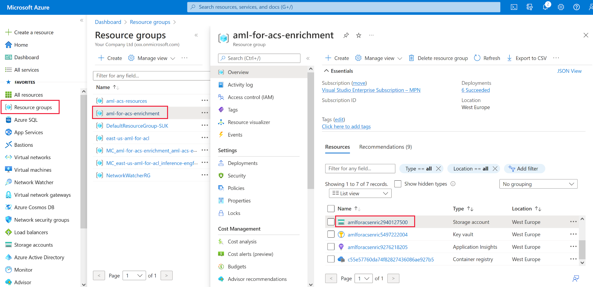

---
lab:
  title: Enriquecimiento de un índice de búsqueda mediante el modelo de Azure Machine Learning
---

# Enriquecimiento de un índice de búsqueda mediante el modelo de Azure Machine Learning

Puede usar la eficacia del aprendizaje automático para enriquecer un índice de búsqueda. Para ello, usará un modelo entrenado en el Estudio de Machine Learning de Azure AI y lo llamará desde un conjunto de aptitudes personalizado de aprendizaje automático.

En este ejercicio, creará un modelo de Estudio de Machine Learning de Azure AI y, después, entrenará, implementará y probará un punto de conexión mediante el modelo. Luego, creará un servicio de Azure Cognitive Search, creará datos de ejemplo y enriquecerá un índice mediante el punto de conexión del Estudio de Machine Learning de Azure AI.

> **Nota**: Para completar este ejercicio, necesitará una suscripción a Microsoft Azure. Si aún no tiene una, puede solicitar una prueba gratuita en [https://azure.com/free](https://azure.com/free?azure-portal=true).
>

## Creación de un área de trabajo de Azure Machine Learning

Antes de enriquecer el índice de búsqueda, cree un área de trabajo de Azure Machine Learning. El área de trabajo le proporcionará acceso al Estudio de Machine Learning de Azure AI, una herramienta gráfica que puede usar para crear modelos de inteligencia artificial e implementarlos para su uso.

1. Inicie sesión en [Azure Portal](https://portal.azure.com).
1. Seleccione **+ Crear un recurso**.
1. Busque aprendizaje automático y, después, seleccione **Azure Machine Learning**.
1. Seleccione **Crear**.
1. Seleccione **Crear nuevo** en **Grupo de recursos** y asígnele el nombre **aml-for-acs-enrichment**.
1. En la sección Detalles del área de trabajo, en **Nombre**, escriba **aml-for-acs-workspace**.
1. Seleccione una **región** admitida cerca de usted.
1. Use los valores predeterminados para **Cuenta de almacenamiento**, **Almacén de claves**, **Application Insights** y **Registro de contenedor**.
1. Seleccione **Revisar + crear**.
1. Seleccione **Crear**.
1. Espere a que se implemente el área de trabajo de Azure Machine Learning y seleccione **Ir al recurso**.
1. En el panel Información general, seleccione **Iniciar Studio**.

## Creación de una canalización de entrenamiento de regresión

Ahora creará un modelo de regresión y lo entrenará mediante una canalización de Estudio de Machine Learning de Azure AI. Entrenará el modelo con datos de precios de automóviles. El modelo, una vez entrenado, predecirá el precio de un automóvil en función de sus atributos.

1. En la página principal, seleccione **Diseñador**.

1. En la lista de componentes precompilados, seleccione **Regression - Automobile Price Prediction (Basic)** (Regresión - Predicción de precios de automóviles [básico]).

    

1. Seleccione **Validar**.

1. En el panel **Validación de grafo**, seleccione el error **Seleccionar destino de proceso en el asistente para envío**.

    
1. En la lista desplegable **Seleccionar tipo de proceso**, elija **Instancia de proceso**. Después, seleccione **Creación de una instancia de proceso de ML de Azure** debajo.
1. En el campo **Nombre del proceso**, escriba un nombre único (por ejemplo, **compute-for-training**).
1. Seleccione **Revisar y crear** y, luego, **Crear**.

1. En el campo **Seleccionar instancia de proceso de Azure ML**, seleccione la instancia en la lista desplegable. Es posible que tenga que esperar hasta que termine el aprovisionamiento.

1. Seleccione **Validar** de nuevo, la canalización debería tener un aspecto correcto.

    
1. Seleccione **Aspectos básicos** en el panel **Configuración del trabajo de canalización**.
1. Seleccione **Crear nuevo** en el nombre del experimento.
1. En **Nombre de nuevo experimento**, escriba **linear-regression-training**.
1. Seleccione **Revisar y enviar** y, después, seleccione **Enviar**.

### Creación de un clúster de inferencia para el punto de conexión

Aunque la canalización está entrenando un modelo de regresión lineal, puede crear los recursos que necesita para el punto de conexión. Este punto de conexión necesita un clúster de Kubernetes para procesar las solicitudes web al modelo.

1. Seleccione **Proceso** a la izquierda.

    
1. Seleccione **Clústeres de Kubernetes** y después **+ Nuevo**.
1. En la lista desplegable, seleccione **AksCompute**.
1. En el panel **Crear AksCompute**, seleccione **Crear nuevo**.
1. En **Ubicación**, seleccione la misma región que usó para crear los demás recursos.
1. En la lista VM sizes (Tamaños de máquina virtual), seleccione **Standard_A2_v2**.
1. Seleccione **Next** (Siguiente).
1. En **Nombre del proceso**, escriba **aml-acs-endpoint**.
1. Seleccione **Enable SSL configuration** (Habilitar configuración de SSL).
1. En **Leaf domain** (Dominio de hoja), escriba **aml-for-acs**.
1. Seleccione **Crear**.

### Registro del modelo entrenado

El trabajo de canalización debería haber finalizado. Descargue los archivos `score.py` y `conda_env.yaml`. Después, registre el modelo entrenado.

1. En el lado izquierdo, seleccione **Trabajos**.

    
1. Seleccione el experimento y, luego, seleccione el trabajo completado en la tabla, por ejemplo, **Regresión: predicción del precio de los automóviles (básico)**. Si se le pide que guarde los cambios, seleccione **Descartar**.
1. En el diseñador, seleccione **Información general del trabajo** en la parte superior derecha y, después, seleccione el nodo **Entrenar modelo**.

    
1. En la pestaña **Resultados y registros**, expanda la carpeta **trained_model_outputs**.
1. Junto a `score.py`, seleccione el menú más (**…**) y, después, **Descargar**.
1. Junto a `conda_env.yaml`, seleccione el menú más (**…**) y, después, **Descargar**.
1. En la parte superior de la pestaña, seleccione **+ Registrar modelo**.
1. En el campo **Salida de trabajo**, seleccione la carpeta **trained_model_outputs**. Después, seleccione **Siguiente** en la parte inferior del panel.
1. En **Nombre**, escriba **carevalmodel** como nombre del modelo.
1. En **Descripción**, escriba **Un modelo de regresión lineal para predecir el precio de los automóviles**.
1. Seleccione **Siguiente**.
1. Seleccione **Registrar**.

### Edición del script de puntuación para responder correctamente a Búsqueda de Azure AI

Estudio de Azure Machine Learning ha descargado dos archivos en la ubicación de descarga predeterminada del explorador web. Debe editar el archivo score.py para cambiar cómo se administran la solicitud y la respuesta JSON. Puede usar un editor de texto o un editor de código como Visual Studio Code.

1. En el editor, abra el archivo score.py.
1. Reemplace todo el contenido de la función run:

    ```python
    def run(data):
    data = json.loads(data)
    input_entry = defaultdict(list)
    for row in data:
        for key, val in row.items():
            input_entry[key].append(decode_nan(val))

    data_frame_directory = create_dfd_from_dict(input_entry, schema_data)
    score_module = ScoreModelModule()
    result, = score_module.run(
        learner=model,
        test_data=DataTable.from_dfd(data_frame_directory),
        append_or_result_only=True)
    return json.dumps({"result": result.data_frame.values.tolist()})
    ```

    Con este código de Python:

    ```python
    def run(data):
        data = json.loads(data)
        input_entry = defaultdict(list)
        
        for key, val in data.items():
                input_entry[key].append(decode_nan(val))
    
        data_frame_directory = create_dfd_from_dict(input_entry, schema_data)
        score_module = ScoreModelModule()
        result, = score_module.run(
            learner=model,
            test_data=DataTable.from_dfd(data_frame_directory),
            append_or_result_only=True)
        output = result.data_frame.values.tolist()
        
        return {
                "predicted_price": output[0][-1]
        }    
    ```

    Los cambios anteriores permiten que el modo reciba un único objeto JSON con atributos de automóvil en lugar de una matriz de automóviles.

    El otro cambio es devolver solo el precio previsto del automóvil en lugar de toda la respuesta JSON.
1. Guarde los cambios en el editor de texto.

## Creación de un entorno personalizado

Ahora, creará un entorno personalizado para que pueda implementar en un punto de conexión en tiempo real.

1. En el panel de navegación, seleccione **Entornos**.
1. Seleccione la pestaña **Entornos personalizados**.
1. Seleccione **+ Create** (+ Crear).
1. En **Nombre**, escriba **my-custom-environment**.
1. En la lista de *entornos mantenidos* en **Seleccionar tipo de entorno**, seleccione la versión de **automl-gpu** más reciente.
1. Seleccione **Siguiente**.
1. En el equipo local, abra el archivo `conda_env.yaml` que ha descargado anteriormente y copie su contenido.
1. Vuelva al explorador y seleccione **conda_dependencies.yaml** en el panel Personalizar.
1. En el panel de la derecha, reemplace su contenido por el código que ha copiado anteriormente.
1. Seleccione **Siguiente** y, luego, otra vez **Siguiente**.
1. Seleccione **Crear** para crear el entorno personalizado.

## Implementación del modelo con el código de puntuación actualizado <!--Option for web service deployment is greyed out. Can't go further after trying several different things.-->

El clúster de inferencia debería estar listo para usarse. También ha editado el código de puntuación para controlar las solicitudes del conjunto de aptitudes personalizado de Azure Cognitive Search. Vamos a crear y probar un punto de conexión para el modelo.

1. En el lado izquierdo, seleccione **Modelos**.
1. Seleccione el modo que ha registrado, **carevalmodel**.

1. Seleccione **Implementar** y, después, **Punto de conexión en tiempo real**.

    
1. En **Nombre**, escriba un nombre único, por ejemplo, **car-evaluation-endpoint-1440637584**.
1. En **Tipo de proceso**, seleccione **Administrado**.
1. En **Tipo de autenticación**, seleccione **Autenticación basada en claves**.
1. Seleccione **Siguiente** y luego otra vez **Siguiente**.
1. Seleccione **Siguiente** de nuevo.
1. En el campo **Seleccione un script de puntuación para la inferencia**, vaya al archivo `score.py` actualizado y selecciónelo.
1. En la lista desplegable **Seleccionar tipo de entorno**, seleccione **Entornos personalizados**.
1. Active la casilla de su entorno personalizado en la lista.
1. Seleccione **Siguiente**.
1. En Máquina virtual, seleccione **Standard_D2as_v4**.
1. Establezca **Recuento de instancias** en **1**.
1. Seleccione **Siguiente** y luego otra vez **Siguiente**.
1. Seleccione **Crear**.

Espere a que se implemente el modelo; esto puede tardar hasta 10 minutos. Puede comprobar el estado en **Notificaciones** o en la sección puntos de conexión del Estudio de Azure Machine Learning.

### Prueba del punto de conexión del modelo entrenado

1. En el panel izquierdo, seleccione **Puntos de conexión**.
1. Seleccione **car-evaluation-endpoint**.
1. Seleccione **Probar** y pegue este JSON de ejemplo en **Punto de conexión de prueba de datos de entrada**.

    ```json
    {
        "symboling": 2,
        "make": "mitsubishi",
        "fuel-type": "gas",
        "aspiration": "std",
        "num-of-doors": "two",
        "body-style": "hatchback",
        "drive-wheels": "fwd",
        "engine-location": "front",
        "wheel-base": 93.7,
        "length": 157.3,
        "width": 64.4,
        "height": 50.8,
        "curb-weight": 1944,
        "engine-type": "ohc",
        "num-of-cylinders": "four",
        "engine-size": 92,
        "fuel-system": "2bbl",
        "bore": 2.97,
        "stroke": 3.23,
        "compression-ratio": 9.4,
        "horsepower": 68.0,
        "peak-rpm": 5500.0,
        "city-mpg": 31,
        "highway-mpg": 38,
        "price": 0.0
    }
    ```

1. Seleccione **Probar**, y debería ver una respuesta:

    ```json
    {
        "predicted_price": 5852.823214312815
    }
    ```

1. Seleccione **Consumir**.

    
1. Copie el **punto de conexión de REST**.
1. Copie el valor de **Clave principal**.

### Integración de un modelo de Azure Machine Learning con Búsqueda de Azure AI

Ahora creará un nuevo servicio de Cognitive Search y enriquecerá un índice mediante un conjunto de aptitudes personalizado.

### Creación de un archivo de prueba

1. En [Azure Portal](https://portal.azure.com/learn.docs.microsoft.com?azure-portal=true), seleccione Grupos de recursos.
1. Seleccione **aml-for-acs-enrichment**.

    
1. Seleccione la cuenta de almacenamiento, por ejemplo, **amlforacsworks1440637584**.
1. En **Configuración**, seleccione **Configuración**. Después, establezca **Permitir el acceso anónimo de blobs** en **Habilitado**.
1. Seleccione **Guardar**.
1. En **Almacenamiento de datos, **seleccione **Contenedores**. 
1. Cree un contenedor para almacenar datos de índice, seleccione **+ Container** (+ Contenedor).
1. En el panel **Nuevo contenedor**, en **Nombre**, escriba **docs-to-search**.
1. En **Nivel de acceso anónimo**, seleccione **Contenedor (acceso de lectura anónimo para contenedores y blobs)**.
1. Seleccione **Crear**.
1. Seleccione el contenedor **docs-to-search** que ha creado.
1. En un editor de texto, cree un documento JSON:

    ```json
    {
      "symboling": 0,
      "make": "toyota",
      "fueltype": "gas",
      "aspiration": "std",
      "numdoors": "four",
      "bodystyle": "wagon",
      "drivewheels": "fwd",
      "enginelocation": "front",
      "wheelbase": 95.7,
      "length": 169.7,
      "width": 63.6,
      "height": 59.1,
      "curbweight": 2280,
      "enginetype": "ohc",
      "numcylinders": "four",
      "enginesize": 92,
      "fuelsystem": "2bbl",
      "bore": 3.05,
      "stroke": 3.03,
      "compressionratio": 9.0,
      "horsepower": 62.0,
      "peakrpm": 4800.0,
      "citympg": 31,
      "highwaympg": 37,
      "price": 0
    }
    ```

    Guarde el documento en la máquina como extensión `test-car.json`.
1. En el portal, seleccione **Cargar**.
1. En el panel **Cargar blob**, seleccione **Buscar archivos**, vaya a donde guardó el documento JSON y selecciónelo.
1. Seleccione **Cargar**.

### Creación de un recurso de Azure AI Search

1. En Azure Portal, en la página principal, seleccione **+ Crear un recurso**.
1. Busque **Búsqueda de Azure AI** y seleccione **Búsqueda de Azure AI**.
1. Seleccione **Crear**.
1. En **Grupo de recursos**, seleccione **aaml-for-acs-enrichment**.
1. Como nombre del servicio, escriba un nombre único, por ejemplo, **acs-enriched-1440637584**.
1. En **Ubicación**, seleccione la misma región que ha usado anteriormente.
1. Seleccione **Revisar y crear** y, luego, **Crear**.
1. Espere a que se implementen los recursos y, después, seleccione **Ir al recurso**.
1. Seleccione **Importar datos**.
1. En el panel **Conectarse a los datos propios**, en el campo **Nombre del origen de datos**, seleccione **Azure Blob Storage**.
1. En **Nombre del origen de datos**, escriba **import-docs**.
1. En **Modo de análisis**, seleccione **JSON**.
1. En **Cadena de conexión**, seleccione **Elegir una conexión existente**.
1. Seleccione la cuenta de almacenamiento en la que cargó, por ejemplo, **amlforacsworks1440637584**.
1. En el panel **Contenedores**, seleccione **docs-to-search**. 
1. Elija **Seleccionar**.
1. Seleccione **Siguiente: Agregar conocimientos cognitivos (opcional)**.

### Agregar conocimientos cognitivos

1. Expanda **Agregar enriquecimientos** y, después, seleccione **Extraer nombres de personas**.
1. Seleccione **Siguiente: Personalizar el índice de destino**.
1. Seleccione **+Agregar campo**, en **Nombre de campo**, escriba **predicted_price** al final de la lista.
1. En **Tipo**, seleccione **Edm.Double** para la nueva entrada.
1. Seleccione **Retrievable** para todos los campos.
1. Seleccione **Se puede buscar** en **hacer**.
1. Seleccione **Siguiente: Crear indizador**.
1. Seleccione **Submit** (Enviar).

## Adición de la aptitud de AML al conjunto de aptitudes

Ahora reemplazará el enriquecimiento de nombres de personas con el conjunto de aptitudes personalizados de Azure Machine Learning.

1. En el panel Información general, seleccione **Conjuntos de aptitudes** en **Administración de búsquedas**.
1. En **Nombre**, seleccione **azureblob-skillset**.
1. Reemplace la definición de aptitudes para `EntityRecognitionSkill` por este JSON y recuerde reemplazar los valores de punto de conexión y clave principal copiados:

    ```json
    "@odata.type": "#Microsoft.Skills.Custom.AmlSkill",
    "name": "AMLenricher",
    "description": "AML studio enrichment example",
    "context": "/document",
    "uri": "PASTE YOUR AML ENDPOINT HERE",
    "key": "PASTE YOUR PRIMARY KEY HERE",
    "resourceId": null,
    "region": null,
    "timeout": "PT30S",
    "degreeOfParallelism": 1,
    "inputs": [
      {
        "name": "symboling",
        "source": "/document/symboling"
      },
      {
        "name": "make",
        "source": "/document/make"
      },
      {
        "name": "fuel-type",
        "source": "/document/fueltype"
      },
      {
        "name": "aspiration",
        "source": "/document/aspiration"
      },
      {
        "name": "num-of-doors",
        "source": "/document/numdoors"
      },
      {
        "name": "body-style",
        "source": "/document/bodystyle"
      },
      {
        "name": "drive-wheels",
        "source": "/document/drivewheels"
      },
      {
        "name": "engine-location",
        "source": "/document/enginelocation"
      },
      {
        "name": "wheel-base",
        "source": "/document/wheelbase"
      },
      {
        "name": "length",
        "source": "/document/length"
      },
      {
        "name": "width",
        "source": "/document/width"
      },
      {
        "name": "height",
        "source": "/document/height"
      },
      {
        "name": "curb-weight",
        "source": "/document/curbweight"
      },
      {
        "name": "engine-type",
        "source": "/document/enginetype"
      },
      {
        "name": "num-of-cylinders",
        "source": "/document/numcylinders"
      },
      {
        "name": "engine-size",
        "source": "/document/enginesize"
      },
      {
        "name": "fuel-system",
        "source": "/document/fuelsystem"
      },
      {
        "name": "bore",
        "source": "/document/bore"
      },
      {
        "name": "stroke",
        "source": "/document/stroke"
      },
      {
        "name": "compression-ratio",
        "source": "/document/compressionratio"
      },
      {
        "name": "horsepower",
        "source": "/document/horsepower"
      },
      {
        "name": "peak-rpm",
        "source": "/document/peakrpm"
      },
      {
        "name": "city-mpg",
        "source": "/document/citympg"
      },
      {
        "name": "highway-mpg",
        "source": "/document/highwaympg"
      },
      {
        "name": "price",
        "source": "/document/price"
      }
    ],
    "outputs": [
      {
        "name": "predicted_price",
        "targetName": "predicted_price"
      }
    ]  
    ```

1. Seleccione **Guardar**.

### Actualización de las asignaciones de campos de salida

1. Vuelva al panel **Información general**, seleccione **Indizadores** y, después, seleccione **azureblob-indexer**.
1. Seleccione la pestaña **Definición del indizador (JSON)** y, después, cambie el valor **outputFieldMappings** a:

    ```json
    "outputFieldMappings": [
        {
          "sourceFieldName": "/document/predicted_price",
          "targetFieldName": "predicted_price"
        }
      ]
    ```

1. Seleccione **Guardar**.
1. Seleccione **Restablecer** y, a continuación, seleccione **Sí**.
1. Seleccione **Ejecutar** y, a continuación, seleccione **Sí**.

## Prueba del enriquecimiento de índices

Ahora, el conjunto de aptitudes actualizado agregará un valor de predicción al documento del coche de prueba en el índice. Para probarlo, siga estos pasos.

1. En el panel **Información general** del servicio de búsqueda, seleccione **Explorador de búsqueda** en la parte superior del panel.
1. Seleccione **Search**.
1. Desplácese hasta la parte inferior de los resultados.
    
Debería ver el campo de relleno `predicted_price`.

## Eliminación de los recursos del ejercicio

Ahora que ha completado el ejercicio, elimine todos los recursos que ya no necesita. Eliminación de los recursos de Azure:

1. En **Azure Portal**, seleccione Grupos de recursos.
1. Seleccione el grupo de recursos que no necesite y luego **Eliminar grupo de recursos**.
