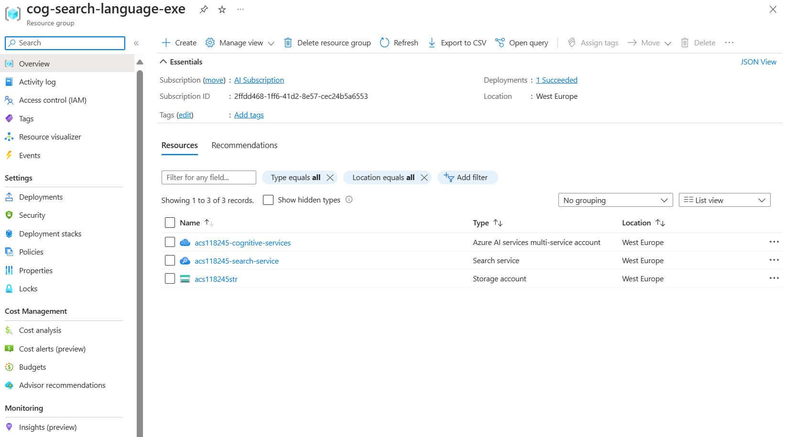

---
lab:
  title: Agregación a un índice mediante la API de inserción
---

# Agregación a un índice mediante la API de inserción

Quiere explorar cómo crear un índice de Búsqueda de Azure AI y cargar documentos en ese índice mediante código de C#.

En este ejercicio, clonará una solución de C# existente y la ejecutará para resolver el tamaño de lote óptimo para cargar documentos. A continuación, usará este tamaño de lote y cargará documentos de forma eficaz mediante un enfoque de subprocesos.

> **Nota**: Para completar este ejercicio, necesitará una suscripción a Microsoft Azure. Si aún no tiene una, puede suscribirse para solicitar una prueba gratuita en [https://azure.com/free](https://azure.com/free?azure-portal=true).

## Configuración de los recursos de Azure

Para ahorrar tiempo, seleccione esta plantilla de Azure Resource Manager para crear los recursos que necesitará más adelante en el ejercicio:

1. [Implementación de recursos en Azure](https://portal.azure.com/#create/Microsoft.Template/uri/https%3A%2F%2Fraw.githubusercontent.com%2FMicrosoftLearning%2Fmslearn-knowledge-mining%2Fmain%2FLabfiles%2F07-exercise-add-to-index-use-push-api%20lab-files%2Fazuredeploy.json): seleccione este vínculo para crear los recursos de Azure AI.
    
1. En **Grupo de recursos**, seleccione **Crear nuevo** y asígnele el nombre **cog-search-language-exe**.
1. En **Región**, seleccione una [región admitida](/azure/ai-services/language-service/custom-text-classification/service-limits#regional-availability) cercana a usted.
1. El **Prefijo de recurso** debe ser único a nivel global; escriba un prefijo aleatorio con números y caracteres en minúsculas como, por ejemplo, **acs118245**.
1. En **Ubicación**, seleccione la misma región que ha elegido anteriormente.
1. Seleccione **Revisar + crear**.
1. Seleccione **Crear**.
1. Una vez finalizada la implementación, seleccione **Ir al grupo de recursos** para ver todos los recursos que ha creado.

    

## Copia de la información de la API de REST del servicio de Búsqueda de Azure AI

1. En la lista de recursos, seleccione el servicio de búsqueda que ha creado. En el ejemplo anterior, **acs118245-search-service**.
1. Copie el nombre del servicio de búsqueda en un archivo de texto.

    
1. A la izquierda, seleccione **Claves** y copie la **Clave de administrador principal** en el mismo archivo de texto.

## Descargar código de ejemplo para usar en Visual Studio Code

Ejecutarás un código de ejemplo de Azure mediante Visual Studio Code. Los archivos de código se han proporcionado en un repositorio de GitHub.

1. Inicie Visual Studio Code.
1. Abra la paleta (Mayús + Ctrl + P) y ejecute un comando **Git: Clone** para clonar el repositorio `https://github.com/MicrosoftLearning/mslearn-knowledge-mining` en una carpeta local (no importa qué carpeta).
1. Cuando se haya clonado el repositorio, abra la carpeta en Visual Studio Code.
1. Espere mientras se instalan archivos adicionales para admitir los proyectos de código de C# en el repositorio.

    > **Nota**: Si se le pide que agregue los recursos necesarios para compilar y depurar, seleccione **Ahora no**.

1. En el panel de navegación de la izquierda, expande la carpeta **optimize-data-indexing/v11/OptimizeDataIndexing** y selecciona el archivo **appsettings.json**.

    
1. Pegue el nombre del servicio de búsqueda y la clave de administrador principal.

    ```json
    {
      "SearchServiceUri": "https://acs118245-search-service.search.windows.net",
      "SearchServiceAdminApiKey": "YOUR_SEARCH_SERVICE_KEY",
      "SearchIndexName": "optimize-indexing"
    }
    ```

    El archivo de configuración debe tener un aspecto similar a lo que se muestra más arriba.
1. Guarde los cambios presionando **CTRL + S**.
1. Haz clic con el botón derecho en la carpeta **OptimizeDataIndexing** y selecciona **Abrir en terminal integrado**.
1. En el terminal, escribe `dotnet run` y presiona **Entrar**.

    
La salida muestra que, en este caso, el tamaño de lote con mejor rendimiento es de 900 documentos. Ya que alcanza 6,071 MB por segundo.

## Edición del código para implementar subprocesos y una estrategia de retroceso y reintento

Hay código marcado que está listo para cambiar la aplicación para que use subprocesos para cargar documentos en el índice de búsqueda.

1. Asegúrese de que ha seleccionado **Program.cs**.

    
1. Comenta las líneas 37 y 38 de esta manera:

    ```csharp
    //Console.WriteLine("{0}", "Finding optimal batch size...\n");
    //await TestBatchSizesAsync(searchClient, numTries: 3);
    ```

1. Quita la marca de comentario de las líneas de 44 a 48.

    ```csharp
    Console.WriteLine("{0}", "Uploading using exponential backoff...\n");
    await ExponentialBackoff.IndexDataAsync(searchClient, hotels, 1000, 8);

    Console.WriteLine("{0}", "Validating all data was indexed...\n");
    await ValidateIndexAsync(indexClient, indexName, numDocuments);
    ```

    El código que controla el tamaño del lote y el número de subprocesos es `await ExponentialBackoff.IndexDataAsync(searchClient, hotels, 1000, 8)`. El tamaño del lote es 1000, y hay ocho subprocesos.

    
    El código debe tener un aspecto parecido a lo que se muestra más arriba.

1. Para guardar los cambios, presione **Ctrl**+**S**.
1. Seleccione el terminal y presione cualquier tecla para finalizar el proceso en ejecución si aún no lo ha hecho.
1. Ejecute `dotnet run` en el terminal.

    La aplicación iniciará ocho subprocesos y, a continuación, a medida que cada subproceso termine de escribir un mensaje nuevo en la consola:

    ```powershell
    Finished a thread, kicking off another...
    Sending a batch of 1000 docs starting with doc 57000...
    ```

    Después de cargar 100 000 documentos, la aplicación escribe un resumen (esto puede tardar en completarse):

    ```powershell
    Ended at: 9/1/2023 3:25:36 PM
    
    Upload time total: 00:01:18:0220862
    Upload time per batch: 780.2209 ms
    Upload time per document: 0.7802 ms
    
    Validating all data was indexed...
    
    Waiting for service statistics to update...
    
    Document Count is 100000
    
    Waiting for service statistics to update...
    
    Index Statistics: Document Count is 100000
    Index Statistics: Storage Size is 71453102
    
    ``````

Explore el código del procedimiento `TestBatchSizesAsync` para ver cómo el código prueba el rendimiento del tamaño del lote.

Explore el código del procedimiento `IndexDataAsync` para ver cómo el código administra los subprocesos.

Explore el código de `ExponentialBackoffAsync` para ver cómo el código implementa una estrategia de retroceso exponencial y reintento.

Puede buscar y comprobar que los documentos se han agregado al índice en Azure Portal.


## Limpieza

Ahora que ha completado el ejercicio, elimine todos los recursos que ya no necesita. Comience con el código clonado en la máquina. A continuación, elimine los recursos de Azure.

1. En **Azure Portal**, seleccione Grupos de recursos.
1. Seleccione el grupo de recursos que ha creado para este ejercicio.
1. Seleccione **Eliminar grupo de recursos**. 
1. Confirme la eliminación y seleccione **Eliminar**.
1. Seleccione los recursos que no necesita y, a continuación, seleccione **Eliminar**.
