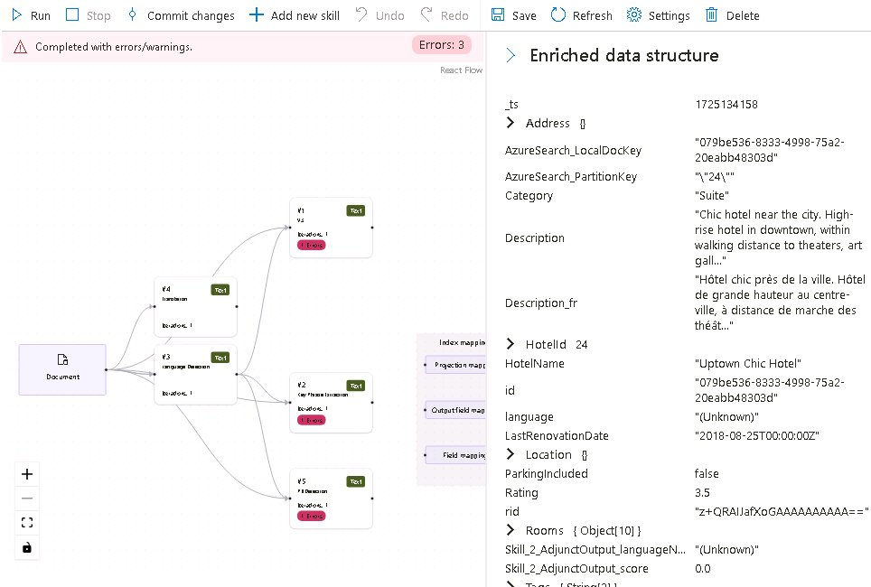
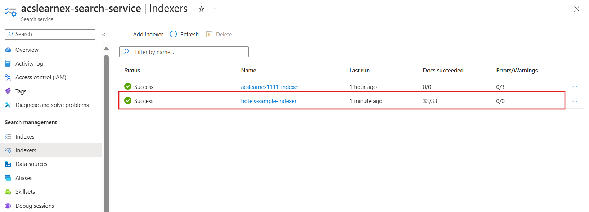

---
lab:
  title: Problemas de búsqueda de depuración
---

# Problemas de búsqueda de depuración

Ha creado la solución de búsqueda, pero ha observado que hay algunas advertencias en el indexador.

En este ejercicio, creará una solución de Búsqueda de Azure AI, importará algunos datos de ejemplo y, a continuación, resolverá una advertencia en el indexador.

> **Nota**: Para completar este ejercicio, necesitará una suscripción a Microsoft Azure. Si aún no tiene una, puede solicitar una prueba gratuita en [https://azure.com/free](https://azure.com/free?azure-portal=true).

## Creación de la solución de búsqueda

Para poder empezar a usar una sesión de depuración, debes crear un servicio de búsqueda de Azure AI.

1. [Implementación de recursos en Azure](https://portal.azure.com/#create/Microsoft.Template/uri/https%3A%2F%2Fraw.githubusercontent.com%2FMicrosoftLearning%2Fmslearn-knowledge-mining%2Fmain%2FLabfiles%2F08-debug-search%2Fazuredeploy.json): si estás en una VM hospedada, copia este vínculo y pégalo en el explorador de VM. De lo contrario, selecciona este vínculo para implementar todos los recursos que necesites en Azure Portal.

    

1. En **Grupo de recursos**, selecciona el grupo de recursos proporcionado o selecciona **Crear nuevo** y escribe **debug-search-exercise**.
1. Selecciona la **Región** más cercana a ti o usa la predeterminada.
1. En **Prefijo de recurso**, escribe **debugsearch** y agrega una combinación aleatoria de números o caracteres para asegurarte de que el nombre de almacenamiento sea único.
1. En Ubicación, seleccione la misma región que usó anteriormente.
1. En la parte inferior del panel, seleccione **Revisar y crear**.
1. Espere hasta que se implemente el recurso y, a continuación, seleccione **Ir al grupo de recursos**.

## Importación de datos de ejemplo y configuración de recursos

Una vez creados los recursos, puede importar los datos de origen.

1. En la lista de recursos, ve a la cuenta de almacenamiento. Ve a **Configuración** en el panel izquierdo, establece **Permitir acceso anónimo al blob** en **Activado** y después selecciona **Guardar**.
1. Vuelve a tu grupo de recursos y selecciona el servicio de búsqueda.
1. En el panel **Información general**, seleccione **Importar datos**.

      

1. En el panel de datos de importación, en Origen de datos, seleccione **Ejemplos**.

      

1. En la lista de ejemplos, seleccione **hotels-sample**.
1. Seleccione **Siguiente: Agregar aptitudes cognitivas (opcional)**.
1. Expanda la sección **Agregar enriquecimientos**.

    

1. Seleccione **Aptitudes cognitivas de texto**.
1. Seleccione **Siguiente: Personalizar índice de destino**.
1. Deje los valores predeterminados y, a continuación, seleccione **Siguiente: Crear un indexador**.
1. Seleccione **Submit** (Enviar).

## Uso de una sesión de depuración para resolver advertencias en el indexador

El indexador comenzará a ingerir 50 documentos. Sin embargo, si comprueba el estado del indexador, verá que hay advertencias.

1. Seleccione **Depurar sesiones** en el panel izquierdo.
1. Seleccione **+ Agregar sesión de depuración**.
1. Proporciona un nombre para la sesión y selecciona **hotel-sample-indexer** en la **Plantilla de indexador**.
1. Selecciona tu cuenta de almacenamiento en el campo **Cuenta de almacenamiento**. Esto creará automáticamente un contenedor de almacenamiento para que contenga los datos de depuración.
1. Deja sin marcar la casilla de autenticación mediante una identidad administrada.
1. Seleccione **Guardar**.
1. Una vez creada, la sesión de depuración se ejecutará automáticamente en los datos del servicio de búsqueda. Debe completarse con errores/advertencias.

    El gráfico de dependencias muestra que, para cada documento, hay un error en tres aptitudes.
    

    > **Nota**: Es posible que veas un error al conectarte a la cuenta de almacenamiento y configurar identidades administradas. Esto sucede si intentas depurar demasiado rápidamente después de habilitar el acceso anónimo a blobs y ejecutar la sesión de depuración debería seguir funcionando. La actualización de la ventana del explorador después de unos minutos debe quitar la advertencia.

1. En el gráfico de dependencias, selecciona uno de los nodos de aptitud que tienen un error.
1. En el panel de detalles de las aptitudes, seleccione **Errores/Advertencias(1)**.

    Los detalles son los siguientes:

    *Código de idioma '(desconocido)' no válido. Idiomas admitidos: af,am,ar,as,az,bg,bn,bs,ca,cs,cy,da,de,el,en,es,et,eu,fa,fi,fr,ga,gl,gu,he,hi,hi,hr,hu,hy,id,it,ja,ka,kk,km,kn,ko,ku,ky,lo,lt,lv,mg,mk,ml,mn,mr,ms,my,ne,nl,no,or,pa, pl,ps,pt-BR,pt-PT,ro,ru,sk,sl,so,sq,sr,ss,sv,sw,ta,te,th,tr,ug,uk,your,uz,vi,zh-Hans,zh-Hant. Para obtener más información, consulta https://aka.ms/language-service/language-support.*

    Si examinas el gráfico de dependencias, la aptitud Detección de idioma tiene salidas a las tres aptitudes con errores. Si observas la configuración de aptitudes con errores, verás que la entrada de aptitud que provoca el error es `languageCode`.

1. En el gráfico de dependencias, seleccione **Detección de idioma**.

    
    Al examinar el JSON de configuración de aptitudes, observe que el campo que se usa para deducir que el idioma es `HotelId`.

    Este campo provocará el error, ya que la aptitud no puede determinar el idioma en función de un identificador.

## Resolución de la advertencia en el indexador

1. Seleccione **origen** en entradas y cambie el campo a `/document/Description`.
1. Seleccione **Guardar**.
1. Seleccione **Run** (Ejecutar). El indexador ya no debe tener errores ni advertencias. El conjunto de aptitudes ya se puede actualizar.

    
   
1. Selecciona **Confirmar cambios** para insertar los cambios realizados en esta sesión en el indexador.
1. Seleccione **Aceptar**. Ahora puedes eliminar la sesión.

Ahora debes asegurarte de que el conjunto de aptitudes está asociado a un recurso de Servicios de Azure AI; de lo contrario, alcanzarás el límite básico y el indexador expirará. 

1. Para ello, seleccione **Conjuntos de aptitudes** en el panel izquierdo y, a continuación, seleccione el conjunto de aptitudes **hotels-sample-skillset**.

    
1. Seleccione **Connect AI Service**, y después, seleccione el recurso de servicios de IA en la lista.

    
1. Seleccione **Guardar**.

1. Ahora ejecute el indexador para actualizar los documentos con los enriquecimientos fijos con IA. Para ello, seleccione **Indexadores** en el panel izquierdo, seleccione  **hotels-sample-indexer** y, a continuación, seleccione **Ejecutar**.  Cuando haya terminado de ejecutarse, debería ver que las advertencias ahora son cero.

    

## Limpieza

 Ahora que ha completado el ejercicio, si terminó de explorar los servicios de Búsqueda de Azure AI, elimine los recursos de Azure que creó durante el ejercicio. La forma más sencilla de hacerlo es eliminar el grupo de recursos **debug-search-exercise**.
