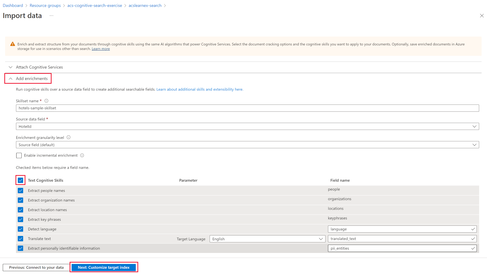

---
lab:
  title: Problemas de búsqueda de depuración
---

# Problemas de búsqueda de depuración

Ha creado la solución de búsqueda, pero ha observado que hay algunas advertencias en el indexador.

En este ejercicio, creará una solución de Búsqueda de Azure AI, importará algunos datos de ejemplo y, a continuación, resolverá una advertencia en el indexador.

> **Nota**: Para completar este ejercicio, necesitará una suscripción a Microsoft Azure. Si aún no tiene una, puede solicitar una prueba gratuita en [https://azure.com/free](https://azure.com/free?azure-portal=true).

## Creación de la solución de búsqueda

Para poder empezar a usar una sesión de depuración, debe crear un servicio de Azure Cognitive Search.

1.  Seleccione este botón para implementar todos los recursos que necesita en Azure Portal.

    

1. En **Grupo de recursos**, haga clic en **Crear nuevo**.
1. Escriba **acs-cognitive-search-exercise**.
1. Seleccione la **región** más cercana.
1. En **Prefijo de recurso**, escriba **acslearnex** y agregue una combinación aleatoria de números o caracteres para asegurarse de que el nombre de almacenamiento es único.
1. En Ubicación, seleccione la misma región que usó anteriormente.
1. En la parte inferior del panel, seleccione **Revisar y crear**.
1. Espere hasta que se implemente el recurso y, a continuación, seleccione **Ir al grupo de recursos**.

## Importar datos de ejemplo

Una vez creados los recursos, puede importar los datos de origen.

1. En los recursos enumerados, seleccione el servicio de búsqueda.

1. En el panel **Información general**, seleccione **Importar datos**.

      

1. En el panel de datos de importación, en Origen de datos, seleccione **Ejemplos**.

      

1. En la lista de ejemplos, seleccione **hotels-sample**.
1. Seleccione **Siguiente: Agregar aptitudes cognitivas (opcional)**.
1. Expanda la sección **Agregar enriquecimientos**.

    

1. Seleccione **Aptitudes cognitivas de texto**.
1. Seleccione **Siguiente: Personalizar índice de destino**.
1. Deje los valores predeterminados y, a continuación, seleccione **Siguiente: Crear un indexador**.
1. Seleccione **Submit** (Enviar).

## Uso de una sesión de depuración para resolver advertencias en el indexador

El indexador comenzará a ingerir 50 documentos. Sin embargo, si comprueba el estado del indexador, verá que hay advertencias.

1. Seleccione **Depurar sesiones** en el panel izquierdo.

1. Seleccione **+ Agregar sesión de depuración**.

1. Seleccione **Elegir una conexión existente** para Cadena de conexión de almacenamiento y, a continuación, seleccione la cuenta de almacenamiento.

    
1. Seleccione **+ Contenedor** para agregar un nuevo contenedor. Asígnele el nombre **acs-debug-storage**.

    

1. Establezca su **Nivel de acceso anónimo** en **Contenedor (acceso de lectura anónimo para contenedores y blobs)**.

1. Seleccione **Crear**.
1. Seleccione el nuevo contenedor en la lista y, a continuación, seleccione **Seleccionar**.

1. Seleccione **Guardar sesión**.

    El gráfico de dependencias muestra que, para cada documento, hay un error en tres aptitudes.
    

1. Seleccione **V3**.
1. En el panel de detalles de las aptitudes, seleccione **Errores/Advertencias(1)**.
1. Expanda la columna **Mensaje** para poder ver los detalles.

    Los detalles son los siguientes:

    *Código de idioma no válido (Desconocido). Idiomas admitidos: ar,cs,da,de,en,es,fi,fr,hu,it,ja,ko,nl,no,pl,pt-BR,pt-PT,ru,sv,tr,zh-Hans. Para más información, consulte: https://aka.ms/language-service/language-support.*

Si examina el gráfico de dependencias, la aptitud Detección de idioma tiene salidas a las tres aptitudes con advertencias. Asimismo, la entrada de aptitud que provoca el error es `languageCode`.

1. En el gráfico de dependencias, seleccione **Detección de idioma**.

    
    Al examinar el JSON de configuración de aptitudes, observe que el campo que se usa para deducir que el idioma es `HotelId`.

    Este campo provocará el error, ya que la aptitud no puede determinar el idioma en función de un identificador.

## Resolución de la advertencia en el indexador

1. Seleccione **origen** en entradas y cambie el campo a `/document/Description`.
    
1. Seleccione **Guardar**.
1. Seleccione **Run** (Ejecutar).

    

    El indexador ya no debe tener errores ni advertencias. El conjunto de aptitudes ya se puede actualizar.

1. Seleccione **Confirmar cambios…**.

    
1. Seleccione **Aceptar**.

1. Ahora debe asegurarse de que el conjunto de aptitudes está asociado a un recurso de Servicios de Azure AI; de lo contrario, alcanzará el límite básico y el indexador expirará. Para ello, seleccione **Conjuntos de aptitudes** en el panel izquierdo y, a continuación, seleccione el conjunto de aptitudes **hotels-sample-skillset**.

    
1. Seleccione la pestaña **Servicios de IA** y, a continuación, seleccione el recurso de servicios de IA en la lista.

    
1. Seleccione **Guardar**.

1. Ahora ejecute el indexador para actualizar los documentos con los enriquecimientos fijos con IA. Para ello, seleccione **Indexadores** en el panel izquierdo, seleccione  **hotels-sample-indexer** y, a continuación, seleccione **Ejecutar**.  Cuando haya terminado de ejecutarse, debería ver que las advertencias ahora son cero.

    

> [!TIP]
> Ahora que ha completado el ejercicio, si terminó de explorar los servicios de Búsqueda de Azure AI, elimine los recursos de Azure que creó durante el ejercicio. La forma más sencilla de hacerlo es eliminar el grupo de recursos **acs-cognitive-search-exercise**.